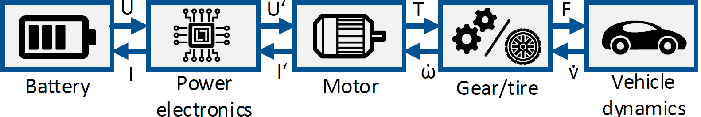

# Vehicle Component Library
  
This repository includes a component library for total vehicle simulations. It is developed at the Institute of Automotve Engineering and contains all relevant components for longitudinal full vehicle simulations. The repoisitory includes one longitudinal simulation model, which is parameterized with a parameter set of a real prototype vehicle and simulated with four different driving cycles. The scematic structure of the model is shown below.



The repository realizes an approach to a modular system simulation. The aim is to gain modularity by making parts of the simulation exchangeable and reusable, by introducing independent components for each part of the simulation. The main idea is to combine pre-processing routines, such as parameter calculation tools and the simulation model, in one component. Thanks to defined boundary conditions, encapsulation and uniform interfaces, a concept has been developed that can be used to create different vehicle models and topologies. The interfaces allow components to exchange parameters as well as signals. 
The included library contains all relevant components for longitudinal full vehicle simulations. The repoisitory also includes one simulation model which is parameterized with a parameter set of a real prototype vehicle and simulated with four different driving cycles. The repository is explained in detail in the corresponding article by Danquah [[1]](https://www.researchgate.net/profile/Benedikt_Danquah).

  
## Getting Started

To get started after downloading the repository matlab has to be opened. The repository must be in the Matlab path. To start the a simulation run the script "Start\_FullVehicle\_Simulation\_SmartFortwo.m". The script opens the longitudinal simulation model SmartFortwo, Parameterize it, run it and show the results.

  
### Prerequisites
To run the code Matlab 2018b or newer is required. Matlab can be downloaded [here](https://de.mathworks.com/downloads/web_downloads/). Additionally the repository needs to be downloaded at [FTM-Repository](www.github.com/TUMFTM/Component_Library_for_Full_Vehicle_Simulations) 
  
### Installing
After the repository is downloaded at  [FTM-Repository](www.github.com/TUMFTM/Component_Library_for_Full_Vehicle_Simulations) it needs to be unpaced in a folder of choice. 
  

  
## Running the Model/Code

To run the code Matlab must be started. Browse to the folder where the repository was unpaced and add the folder to the Matlab Path. By running the script "Start\_FullVehicle\_Simulation\_SmartFortwo.m" the simulation starts. to run the script type following command in the command line
  
```
\>> Start_FullVehicle_Simulation_SmartFortwo.m
```
  
  
## Contributing and Support
  
For contributing to the code please contact [danquah@ftm.mw.tum.de](danquah@ftm.mw.tum.de) or [opensource@ftm.mw.tum.de](opensource@ftm.mw.tum.de)
  
## Versioning
V0.1 Initial Commit
  
  
## Authors
Benedikt Danquah, Alexander Koch, Tony Weiß, Markus Lienkamp, Andrié Pinnel, Johannes Rühm, Benedikt Taiber, Svenja Kalt.

## Acknowledgement
The Authors want to thank research associates of the Institute of Automotive Engineering, who reviewed and gave advise for the component library.


  
## License
This project is licensed under the LGPL License - see the LICENSE.md file for details

##Sources

[[1]](https://www.researchgate.net/profile/Benedikt_Danquah) Benedikt Danquah, Alexander Koch, Tony Weiß, Markus Lienkamp, Modular, Open Source Simulation Approach: Application to Design and Analyze Electric Vehicles, in fourteenth International Conference on Ecological Vehicles and Renewable Energies, Monaco, 2019.
  
[2] S. Rohr, Technisch-wirtschaftliche Analyse des Zweitnutzungspotentials von Lithium-Ionen-Traktionsbatterien, Dissertation, Institute of Automotive Technology, Technical University Munich,
Munich, 2018.

[3] M. K. Tschochner, Comparative Assessment of Early Development Phase Powertrain Concepts, Dissertation, Institute of Automotive Technology, Technical University Munich, Munich, 2018.

[4] L. Horlbeck, Auslegung elektrischer Maschinen für
automobile Antriebsstr¨ange unter Berücksichtigung des Überlastpotentials, Dissertation, Institute of Automotive Technology, Technical University Munich, Munich, 2018.

[5] P. Wacker, Effizienzsteigerung im Antriebsstrang von Elektrofahrzeugen mittels aktiver Batteriepackverschaltung, Dissertation, Institute of Automotive Technology, Technical University Munich, Munich, 2018.

[6] P. Wacker, L. Wheldon, M. Sperlich, J. Adermann, and M. Lienkamp, Influence of active battery switching on the drivetrain efficiency of electric vehicles, in 2017 IEEE Transportation Electrification Conference (ITEC), Chicago, 2017.

[7] J. Adermann, D. Brecheisen, P. Wacker, and M. Lienkamp, Parameter Estimation of Traction Batteries by Energy and Charge Counting during Reference Cycles, in 2017 IEEE 86th Vehicular Technology Conference (VTC-Fall), Toronto, 2017.

[[8]](https://www.researchgate.net/publication/317297615_Efficiency_determination_of_active_battery_switching_technology_on_roller_dynamometer) P. Wacker, J. Adermann, B. Danquah, and M. Lienkamp, Efficiency determination of active battery switching technology on roller dynamometer, in Twelfth International Conference on Ecological Vehicles and Renewable Energies, Monaco, 2017.
 
